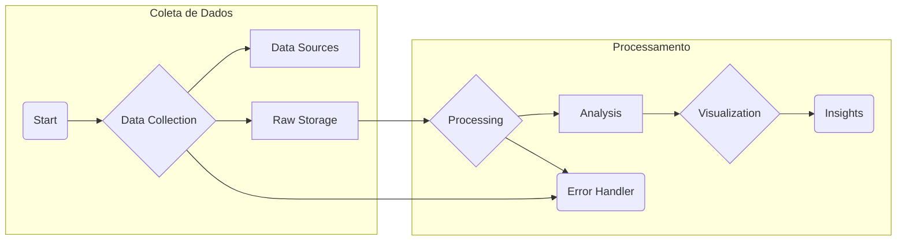

---

# COVID19-Data-Analysis

Este projeto realiza a análise de dados de COVID-19 para os estados dos EUA, usando dados do repositório da Johns Hopkins University (JHU) [CSSEGISandData/COVID-19](https://github.com/CSSEGISandData/COVID-19). Os dados abrangem o período de 4/12/2020 até 10/03/2023. Utilizando Streamlit, visualizamos as estatísticas de COVID-19 em um painel interativo.

## Executando o Projeto

Para rodar o projeto, execute o seguinte comando:

```bash
streamlit run src/data/app.py
```

## Estrutura do Projeto



### Descrição dos Arquivos Principais

- **acquisition.py**: Faz o download dos dados brutos de COVID-19 do repositório da JHU.
- **etl.py**: Realiza o processo de ETL (Extração, Transformação e Carga) para limpar e processar os dados.
- **data_loader.py**: Carrega os dados processados para serem usados pela aplicação.
- **visualization.py** e **charts.py**: Geram gráficos e visualizações dos dados para o painel.
- **app.py**: Código principal que executa a interface web no Streamlit.

## Funcionalidades

- Painel de controle com opções para selecionar estado, métrica de mapa e data.
- Mapa interativo mostrando os casos confirmados por estado.
- Gráficos de casos acumulados, testes, hospitalizações, novos casos diários, e taxa de fatalidade.

## Fonte dos Dados

Este projeto utiliza dados do repositório da [Johns Hopkins University CSSEGISandData/COVID-19](https://github.com/CSSEGISandData/COVID-19).

---

Sinta-se à vontade para personalizar ou expandir conforme necessário!

